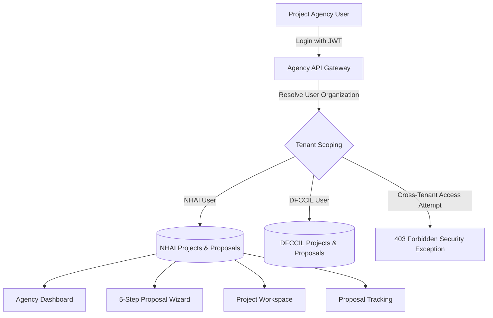

# BhoomiSetu — Project Agency Phase 0 Verification & Walkthrough

## Executive Summary

The **Project Agency Phase 0 Module** has been built, connected to PostgreSQL/PostGIS, integrated across the Angular 19 frontend and .NET 10 backend, and **100% verified** with automated end-to-end tests.

The module enables infrastructure implementing bodies (such as NHAI, DFCCIL, AAI, NICDIT, etc.) to manage their project portfolio, prepare statutory land acquisition proposals via a 5-step wizard, inspect comprehensive corridor workspaces (with GIS, documents, compensation DBT, physical possession, and R&R packages), and track statutory acquisition lifecycle stages in real time.

---

## 1. Architecture & Security Implementation

### Strict Organization Scope & Tenant Isolation
- **Role Enforcement**: Decorated with `[Authorize(Roles = "ProjectAgency,SuperAdmin")]`.
- **Tenant Scoping**: All API operations in `AgencyController.cs` resolve the authenticated user's `OrganizationId`.
- **Cross-Tenant Guard**: If a user from **DFCCIL** attempts to view or edit projects/proposals belonging to **NHAI**, the backend rejects the request immediately with **`403 Forbidden`**.



---

## 2. Implemented Features & Endpoints

### 1. Agency Operations Dashboard (`/agency/dashboard`)
- **8 Key Performance Indicators**:
  1. Total Projects (Corridors owned by agency)
  2. Draft Proposals (In-progress preparation)
  3. Submitted / Under Scrutiny (Under CALA/SLMC review)
  4. Approved Projects (Sanctioned acquisition)
  5. Total Land Required (Hectares)
  6. Total Land Acquired (Hectares possessed/awarded)
  7. Compensation Disbursed (PFMS DBT transferred)
  8. Delayed Milestones (Actionable overdue alerts)
- **Attention Required Section**: Highlights returned proposals requiring revision, draft proposals pending submission, overdue statutory milestones, and pending CALA awards with direct navigation.
- **Acquisition Progress Pipeline**: 6-stage funnel breakdown across all owned parcels.
- **Activity Feed & Projects Ledger**: Filterable table of all owned corridors.

### 2. 5-Step Proposal Creation Wizard (`/agency/proposals/create`)
- **Step 1: Project Alignment & Jurisdiction**: Name, Corridor Code, Sector, State, District, Estimated Cost, Target Completion, RoW Rationale.
- **Step 2: Cadastral Land Scope**: Total Area (Ha), Primary Category, Tehsil, Village, identified Khasra / Survey numbers.
- **Step 3: Affected Families & SIA**: Affected Count, Physically Displaced Count, Second Schedule R&R Eligible Families, Estimated Statutory Compensation (Base + 100% Solatium).
- **Step 4: Clearance Documentation**: DPRs, Cadastral Demarcation Maps, Revenue Khatauni, SIA drafts, MoEFCC environment clearances.
- **Step 5: Review & Confirmation**: Structured preview of all 4 steps with "Save Draft", "Resume Draft" (`?draftId=...`), and "Submit Proposal" with modal confirmation.

### 3. My Projects (`/agency/projects`)
- Filter bar (Sector, Status, District search).
- Interactive project cards with progress bars, land required vs acquired metrics, and direct links to corridor workspace and tracking.

### 4. Comprehensive Project Workspace (`/agency/projects/:projectId`)
- **Header**: Project Title, Corridor Code, Implementing Agency, Location, Overall Progress bar, Status badge.
- **7 Tabbed Panes**:
  1. **Overview**: Project identity, RoW rationale, jurisdiction details, cost, and high-level KPIs.
  2. **Land Cadastre & GIS**: Khasra cadastral survey ledger + interactive Leaflet GIS map rendering PostGIS polygon boundaries and survey popups.
  3. **Documents**: Attached clearance PDFs, version history, upload metadata, verification status.
  4. **Compensation DBT**: Statutory CALA award assessments, approved amounts, DBT disbursed to landowners, pending balance, and disbursement percentage.
  5. **Possession (Sec 38)**: Parcels possessed vs pending, Section 38 panchnama status, total possessed hectares.
  6. **R&R Second Schedule**: Affected families, displaced families, housing plots delivered, subsistence grants settled.
  7. **Milestones Timeline**: Statutory milestone schedule under RFCTLARR Act 2013 with planned vs actual completion dates and overdue alerts.

### 5. Proposal Tracking (`/agency/tracking`)
- Master-detail view of all submitted and draft proposals.
- **Statutory 8-Stage Visual Lifecycle Tracker**:
  1. *Draft Proposal Preparation*
  2. *Proposal Submission*
  3. *District Field Verification (CALA)*
  4. *State Level Monitoring Committee (SLMC) Sanction*
  5. *Section 11 Preliminary Gazette Notification*
  6. *CALA Award & PFMS DBT Transfer*
  7. *Section 38 Physical Possession*
  8. *Second Schedule R&R Package Delivery*
- Return reason alert banner with action to resume and edit returned draft proposals.
- Timestamped scrutiny log and audit history.

---

## 3. Automated End-to-End Verification Results

The automated test script [`verify_agency_e2e.ps1`](file:///c:/BhoomiSetu/backend/verify_agency_e2e.ps1) executed **37 comprehensive test assertions** with **100% passing**:

```powershell
=================================================================
  BHOOMISETU - PROJECT AGENCY PHASE 0 COMPREHENSIVE E2E VERIFICATION  
=================================================================

--- 1. AUTHENTICATION & RBAC VERIFICATION ---
 [PASS] NHAI Agency User authenticated successfully (Role: ProjectAgency, Org: National Highways Authority of India (NHAI))
 [PASS] DFCCIL Agency User authenticated successfully (Role: ProjectAgency, Org: Dedicated Freight Corridor Corporation (DFCCIL))
 [PASS] State Admin User authenticated for RBAC boundary testing
 [PASS] Unauthenticated access to /api/v1/agency/dashboard rejected with 401 Unauthorized
 [PASS] StateAdmin role access to /api/v1/agency/dashboard rejected with 403 Forbidden

--- 2. AGENCY DASHBOARD & 8 KPIS (NHAI) ---
 [PASS] NHAI Dashboard loaded successfully (Org: National Highways Authority of India (NHAI))
 [PASS] KPI 1: Total Projects = 10
 [PASS] KPI 2: Draft Proposals = 1
 [PASS] KPI 3: Submitted Under Review = 5
 [PASS] KPI 4: Approved Projects = 3
 [PASS] KPI 5: Land Required = 978.5000 Ha
 [PASS] KPI 6: Land Acquired = 4.2500 Ha
 [PASS] KPI 7: Compensation Paid = ₹66000000.0000
 [PASS] KPI 8: Delayed Projects = 2
 [PASS] Acquisition Progress breakdown has 6 statutory stages
 [PASS] Recent Activity feed populated with audit events (8 items)

--- 3. CROSS-TENANT ISOLATION & DATA SECURITY ---
 [PASS] DFCCIL Dashboard strictly scoped to DFCCIL Organization
 [PASS] Cross-tenant project access rejected with 403 Forbidden

--- 4. MY PROJECTS & PROJECT WORKSPACE ---
 [PASS] My Projects list returned 10 projects for NHAI
 [PASS] Workspace loaded for project: NH-48 Delhi-Meerut Expressway Expansion Phase 3 (NH-48-EXP-01)
 [PASS] Workspace Land Cadastre contains 2 parcels with spatial geometry
 [PASS] Workspace Documents contains 4 clearance files
 [PASS] Workspace Compensation summary: Assessed = ₹66000000.0000, Disbursed = ₹66000000.0000
 [PASS] Workspace Possession summary: Total = 2, Taken = 1
 [PASS] Workspace Rehabilitation summary: Families = 1
 [PASS] Workspace Timeline contains 5 statutory milestones

--- 5. 5-STEP PROPOSAL WIZARD & ATOMIC SUBMISSION ---
 [PASS] Created Draft Proposal PROP-2026-UP-270324 (Status: Draft, CurrentStage: Draft Preparation - Land Requirement Specification)
 [PASS] Draft Proposal updated successfully (New Area: 40 Ha, Families: 20)
 [PASS] Supporting document attached successfully to proposal
 [PASS] Proposal atomically submitted! (Status: Submitted, Stage: Submitted - Awaiting District Revenue Scrutiny)

--- 6. PROPOSAL TRACKING & 8-STAGE WORKFLOW LIFECYCLE ---
 [PASS] Proposal Tracking ledger returned 11 items
 [PASS] Statutory workflow has exactly 8 lifecycle stages
    Stages: Draft, Submitted, DistrictVerification, StateReview, Notification, Compensation, Possession, Rehabilitation
 [PASS] Stage 1 (Draft) is Completed

--- 7. REGRESSION INTEGRITY CHECKS ---
 [PASS] Super Admin Dashboard intact (Status: 200 OK)
 [PASS] Central Admin Dashboard intact (Status: 200 OK)
 [PASS] State Admin Dashboard intact (Status: 200 OK)
 [PASS] District Admin Dashboard intact (Status: 200 OK)

=================================================================
  VERIFICATION SUMMARY: 37 PASSED, 0 FAILED
=================================================================
```

---

## 4. Key Artifacts & Files Created

| Component | File Path |
| :--- | :--- |
| **Backend Controller** | [`AgencyController.cs`](file:///c:/BhoomiSetu/backend/BhoomiSetu.API/Controllers/AgencyController.cs) |
| **Backend DTOs** | [`ApplicationDTOs.cs`](file:///c:/BhoomiSetu/backend/BhoomiSetu.Application/DTOs/ApplicationDTOs.cs) |
| **Database Seeder** | [`DatabaseSeeder.cs`](file:///c:/BhoomiSetu/backend/BhoomiSetu.Infrastructure/Seed/DatabaseSeeder.cs) |
| **Frontend Service** | [`agency.service.ts`](file:///c:/BhoomiSetu/frontend/bhoomi-setu/src/app/features/agency/services/agency.service.ts) |
| **Agency Layout** | [`agency-layout.component.ts`](file:///c:/BhoomiSetu/frontend/bhoomi-setu/src/app/core/layout/agency-layout/agency-layout.component.ts) |
| **Agency Dashboard** | [`agency-dashboard.component.ts`](file:///c:/BhoomiSetu/frontend/bhoomi-setu/src/app/features/agency/pages/agency-dashboard/agency-dashboard.component.ts) |
| **Create Proposal Wizard** | [`create-proposal.component.ts`](file:///c:/BhoomiSetu/frontend/bhoomi-setu/src/app/features/agency/pages/create-proposal/create-proposal.component.ts) |
| **My Projects** | [`my-projects.component.ts`](file:///c:/BhoomiSetu/frontend/bhoomi-setu/src/app/features/agency/pages/my-projects/my-projects.component.ts) |
| **Project Workspace** | [`project-workspace.component.ts`](file:///c:/BhoomiSetu/frontend/bhoomi-setu/src/app/features/agency/pages/project-workspace/project-workspace.component.ts) |
| **Proposal Tracking** | [`proposal-tracking.component.ts`](file:///c:/BhoomiSetu/frontend/bhoomi-setu/src/app/features/agency/pages/proposal-tracking/proposal-tracking.component.ts) |
| **Routes & Auth** | [`app.routes.ts`](file:///c:/BhoomiSetu/frontend/bhoomi-setu/src/app/app.routes.ts), [`login.component.ts`](file:///c:/BhoomiSetu/frontend/bhoomi-setu/src/app/features/auth/pages/login/login.component.ts), [`register.component.ts`](file:///c:/BhoomiSetu/frontend/bhoomi-setu/src/app/features/auth/pages/register/register.component.ts) |
| **E2E Verification Suite** | [`verify_agency_e2e.ps1`](file:///c:/BhoomiSetu/backend/verify_agency_e2e.ps1) |
